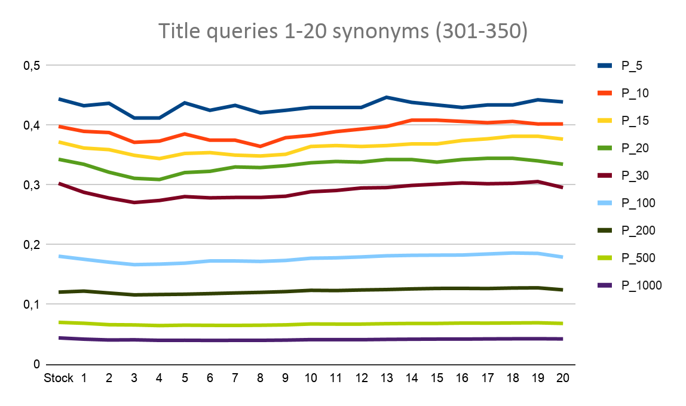

# Exploration of Data Mining & Information Retrieval, based on DUTH course (Semester 8)

## Part 1 
Tokenization and Krovetz stemming using [Lemur Indri](https://lemurproject.org)  search Engine, an open source text search engine. <br>
**Tasks**:
-  Build custom Index 
```
<parameters>
 <corpus>
   <path>/home/user/Downloads/IR-2019-2020-Project-1/ft</path>
   <class>trectext</class>
 </corpus>
 <corpus>
   <path>/home/user/Downloads/IR-2019-2020-Project-1/fr94</path>
   <class>trectext</class>
 </corpus>
 <corpus>
   <path>/home/user/Downloads/IR-2019-2020-Project-1/fbis</path>
   <class>trectext</class>
 </corpus>
 <corpus>
   <path>/home/user/Downloads/IR-2019-2020-Project-1/latimes</path>
   <class>trectext</class>
 </corpus>
 <index>/home/user/Downloads/IR-2019-2020-Project-1/indices/example</index>
 <memory>4096M</memory>
 <storeDocs>true</storeDocs>
 <stemmer><name>Krovetz</name></stemmer>
</parameters>
```
-  View contents of default settings
```
IndriBuildIndex IndriBuildIndex.parameter.file.
&&
dumpindex /home/user/Downloads/IR-2019-2020-Project-1/indices/example v
```
- Run Query and save in results.trec file
```
IndriRunQuery IndriRunQuery.queries.file.301-450-titles-only.EXAMPLE > results.trec
```
-  Trec evaluation
```
./trec_eval  /home/user/Downloads/IR-2019-2020-Project-1/qrels.301-350.trec6.adhoc /home/user/Downloads/IR-2019-2020-Project-1/results.trec > 301-350_default.trec
```
Additional Steps for further optimizations:
<ol>
    <li> Preprocess Queries in qGen.py </li>
    <ol> 
    <li> Replace '-' with space ' ' </li>
    <li> Replace '\' with space ' ' </li>  
    <li> Replace '&' with space 'and' </li>  
    <li> Remove punctuation </li>  
    </ol> 
    <li> Replacing words with synonyms from thesaurus </li>
    <ol> 
    <li> API from Natural Language Toolkit implementation</li>
    <li> Example (4 synonyms for each word):  <br>International Organized Crime =>  International Organized Crime  International form crime  international organize offense  external organise criminal offense  international organize criminal offence </li>
    </ol> 
    <li>Scripted Process - autorunner.sh</li>
</ol> </ol> 

### Results  

Best results are provided for 13 synonyms for queries 301-350, using only the titles as our queries

## Part 2
*Predicting the Probability of Occurence for the Marine Species Engraulis Encrasicolus.* 
<br>

Aim was to process a large dataset for more accurate predictions. The notebooks are self-explainable as much as possible from their markdon fields<br>
**Plots.ipynb** aims to plot our data and detect correlations among their features in order to preprocess them more efficiently. <br>
**LightGBM.ipynb** is responsible for the detections of the preprocessed data. The main idea is not to play around with it for optimal parameterization, but a more efficient preprocessing method taht could provide more accurate results.